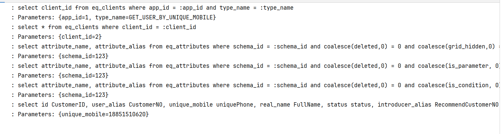
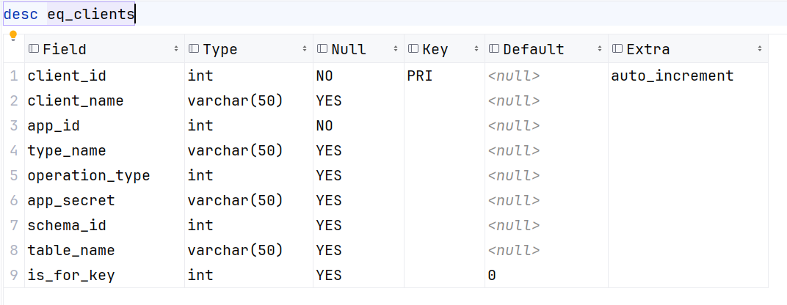
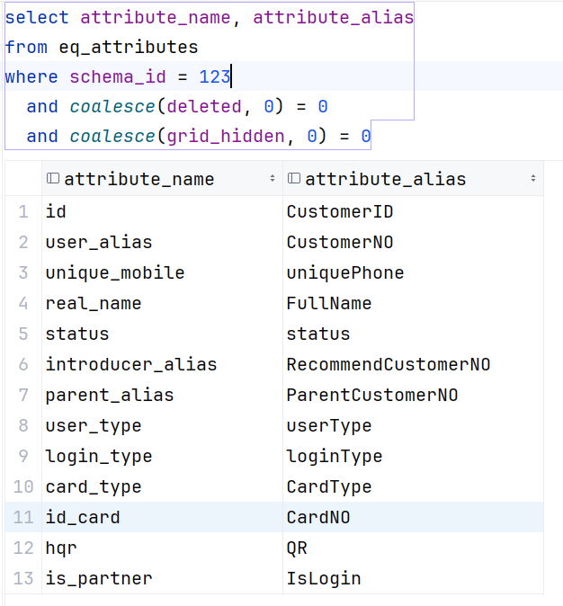

# 接口Framework

前言：

我们需要明确一下，此程序的定位和用途

定位：程序框架而非具体的程序。

具体的要求为，简单、可靠、非赢 

用途：作为一个不同系统之间的联络接口，构造这个系统的主要目的是打破不同系统之间的信息孤岛，起到一个连接不同系统的纽带的作用。作为一个纽带，重要的是简单、可靠和安全。而且系统与系统之间的交互基本上也就可以分为几种。


### 1、通用获取数据接口，这一类的接口不需要分页，专注于获取数据

**请求参数**

```JSON
{
	"appId": "1",
	"sign": "ec5dced37e3e9824d949b9d47954f7d7c1da1d835f262f7d5924e3114bbb54c0",
	"type": "GET_USER_BY_UNIQUE_MOBILE",
	"parameter": {
		"uniquePhone": "18851510620"
	}
}
```

**结果：**

```JSON
{
	"code": 200,
	"msg": "操作成功",
	"data": [
		{
			"CustomerID": 5,
			"CustomerNO": "1",
			"uniquePhone": "18851510620",
			"FullName": "张三",
			"status": 1,
			"RecommendCustomerNO": "2222222",
			"ParentCustomerNO": null,
			"userType": 2,
			"loginType": "",
			"CardType": 1,
			"CardNO": "10012012548523654X",
			"QR": 20,
			"IsLogin": 0
		}
	]
}
```

```json
{
	"appId": "1",
	"sign": "ec5dced37e3e9824d949b9d47954f7d7c1da1d835f262f7d5924e3114bbb54c0",
	"type": "LOGIN_BY_USER_AND_PASSWORD",
	"parameter": {
		"customerNO": "1",
		"password": "123456"
	}
}
```

**结果：**

```json
{
	"code": 200,
	"msg": "操作成功",
	"data": [
		{
			"uniquePhone": "18851510620",
			"customerID": 5,
			"customerNO": "1",
			"realName": "张三",
			"status": 1,
			"recommendCustomerNO": "2222222",
			"parentCustomerNO": null,
			"customerType": 2,
			"cardType": 1,
			"QR": 20,
			"IsLogin": 0
		}
	]
}
```


以上的均是通过通用接口获取的数据。即，使用不同的参数，通过同一个接口获取不同的、每个请求接口期望的结果。

这是如何实现的？

我们以这个通过手机唯一手机号获取会员信息来示例

```json
{
	"appId": "1",
	"sign": "ec5dced37e3e9824d949b9d47954f7d7c1da1d835f262f7d5924e3114bbb54c0",
	"type": "GET_USER_BY_UNIQUE_MOBILE",
	"parameter": {
		"uniquePhone": "18851510620"
	}

```

当我们像后台发送请求的是时候。我们的后台会记录以下的日志



我们来解释一下每一句查询语句的作用

查询客户端：

```sql
select *
from eq_clients
where client_id = (select client_id from eq_clients where app_id = :app_id and type_name = :type_name)
# Parameters: {app_id=1, type_name=GET_USER_BY_UNIQUE_MOBILE}
```

这个框架对于每一个请求的接口都视为一个`客户端`(这是这个框架对于接口的定义，只是对于命名上的定义)，在框架链接的数据空中需要有一个配置表，记录所有的客户端信息，也就是每个接口的信息。

表结构如下。



| 字段名称       | 含义       | 说明                                                         |
| -------------- | ---------- | ------------------------------------------------------------ |
| client_id      | 客户端ID   | 客户端的唯一ID                                               |
| client_name    | 客户端名称 | 客户端名称                                                   |
| app_id         | 三方平台ID | 每一个平台都有一个标识，可以通过这个标识记录日志，和通过ID查询加密秘钥 |
| type_name      | 类型       | 操作类型，用于识别通过通用接口的具体操作                     |
| operation_type | 操作类型   | 操作类型（）                                                 |
| app_secret     | 秘钥       | app秘钥                                                      |
| schema_id      | 配置ID     | 配置ID，用于匹配Attributes 表中的配置                        |
| table_name     | 表名       | 要查询的表名                                                 |

当程序执行了以上的SQL，可以获得具体的客户端配置。通过客户端的配置中的`schemaID`可以获取具体的配置，包括，参数、返回结果包括的字段。

比如通过手机号获取会员信息返回的信息为

```json
{
	"code": 200,
	"msg": "操作成功",
	"data": [
		{
			"CustomerID": 5,
			"CustomerNO": "1",
			"uniquePhone": "18851510620",
			"FullName": "张三",
			"status": 1,
			"RecommendCustomerNO": "2222222",
			"ParentCustomerNO": null,
			"userType": 2,
			"loginType": "",
			"CardType": 1,
			"CardNO": "10012012548523654X",
			"QR": 20,
			"IsLogin": 0
		}
	]
}
```

是因为在`eq_attributes`中有着一下的配置



在`attribute_name`中记录的都是要查询的表中的字段。`attribute_alias`中是指定的名称，这样做的目的是为了解决在不同的系统上数据库中的字段命名不一致的问题。

